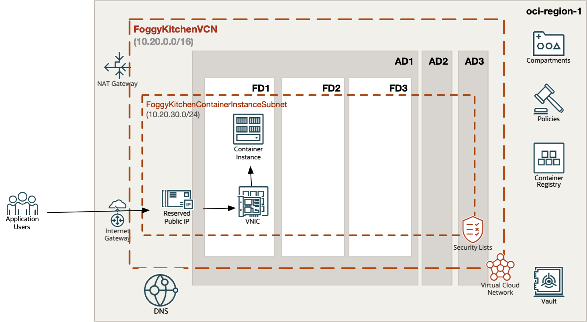

# OCI Container Instance with image taken from OCI Registry (OCIR)

## Project description

In this repository, I have documented my hands on experience with Terrafrom for the purpose of Container Instance deployment with image taken from OCI Registry (OCIR). This set of HCL based Terraform files which can customized according to any requirements.  

## Topology Diagram 

With the usage of this example HCL code you can build topology documented by diagram below. This topology is extremly simplified for education purposes and rather cannot be used for production implementations. 



## How to use code 

### Deploy Using Oracle Resource Manager

1. Click [](https://cloud.oracle.com/resourcemanager/stacks/create?region=home&zipUrl=https://github.com/mlinxfeld/terraform-oci-container-instance/releases/latest/download/terraform-oci-container-instance-stack-latest.zip)

    If you aren't already signed in, when prompted, enter the tenancy and user credentials.

2. Review and accept the terms and conditions.

3. Select the region where you want to deploy the stack.

4. Follow the on-screen prompts and instructions to create the stack.

5. After creating the stack, click **Terraform Actions**, and select **Plan**.

6. Wait for the job to be completed, and review the plan.

    To make any changes, return to the Stack Details page, click **Edit Stack**, and make the required changes. Then, run the **Plan** action again.

7. If no further changes are necessary, return to the Stack Details page, click **Terraform Actions**, and select **Apply**. 

### Deploy Using the Terraform CLI

#### STEP 1.

Clone the repo from GitHub.com by executing the command as follows and then go to terraform-oci-private-oke directory:

```
[opc@terraform-server ~]$ git clone https://github.com/mlinxfeld/terraform-oci-container-instance
Cloning into 'terraform-oci-container-instance'...
remote: Enumerating objects: 24, done.
remote: Counting objects: 100% (24/24), done.
remote: Compressing objects: 100% (21/21), done.
remote: Total 24 (delta 6), reused 21 (delta 3), pack-reused 0
Receiving objects: 100% (24/24), 10.31 KiB | 959.00 KiB/s, done.
Resolving deltas: 100% (6/6), done.

[opc@terraform-server ~]$ cd terraform-oci-container-instance/

[opc@terraform-server terraform-oci-container-instance]$ ls -latr

-rw-r--r--.  1 opc opc  7957 Jan 26 14:32 schema.yaml
-rw-r--r--.  1 opc opc   292 Jan 26 14:32 compartment.tf
-rw-r--r--.  1 opc opc 21235 Jan 26 14:32 README.md
drwxr-xr-x.  2 opc opc    60 Jan 26 14:32 templates
-rw-r--r--.  1 opc opc  1645 Jan 26 14:34 artifacts_container_repository.tf
-rw-r--r--.  1 opc opc   743 Jan 26 14:37 provider.tf
-rw-r--r--.  1 opc opc   952 Jan 26 14:49 variables.tf
-rw-r--r--.  1 opc opc     3 Jan 26 14:52 outputs.tf
-rw-r--r--.  1 opc opc   527 Jan 26 15:02 locals.tf
-rw-r--r--.  1 opc opc  3506 Jan 26 15:03 network.tf
-rw-r--r--.  1 opc opc   992 Jan 26 15:06 datasources.tf
-rw-r--r--.  1 opc opc  1612 Jan 26 15:42 container_instance.tf
```

#### STEP 2.

Within web browser go to URL: https://www.terraform.io/downloads.html. Find your platform and download the latest version of your terraform runtime. Add directory of terraform binary into PATH and check terraform version:

```
[opc@terraform-server terraform-oci-container-instance]$ export PATH=$PATH:/home/opc/terraform

[opc@terraform-server terraform-oci-container-instance]$ terraform --version

Terraform v1.0.0

Your version of Terraform is out of date! The latest version
is 1.2.2. You can update by downloading from https://www.terraform.io/downloads.html
```

#### STEP 3. 
Next create environment file with TF_VARs (we assume Container Instance will be exposed to public via ephemeral public IP):

```
[opc@terraform-server terraform-oci-container-instance]$ vi setup_oci_tf_vars.sh
export TF_VAR_user_ocid="ocid1.user.oc1..aaaaaaaaob4qbf2(...)uunizjie4his4vgh3jx5jxa"
export TF_VAR_tenancy_ocid="ocid1.tenancy.oc1..aaaaaaaas(...)krj2s3gdbz7d2heqzzxn7pe64ksbia"
export TF_VAR_compartment_ocid="ocid1.tenancy.oc1..aaaaaaaasbktyckn(...)ldkrj2s3gdbz7d2heqzzxn7pe64ksbia"
export TF_VAR_fingerprint="00:f9:d1:41:bb:57(...)82:47:e6:00"
export TF_VAR_private_key_path="/tmp/oci_api_key.pem"
export TF_VAR_region="eu-frankfurt-1"
export TF_VAR_ocir_user_name="<oci_iam_user>"
export TF_VAR_ocir_user_password="<oci_iam_auth_token>"
export TF_VAR_enable_reserved_public_ip=false
export TF_VAR_enable_ephemeral_public_ip=true

[opc@terraform-server terraform-oci-container-instance]$ source setup_oci_tf_vars.sh
```

#### STEP 4.
Run *terraform init* with upgrade option just to download the lastest neccesary providers:

```
[opc@terraform-server terraform-oci-container-instance]$ terraform init 

Initializing the backend...

Initializing provider plugins...
- Finding latest version of hashicorp/null...
- Finding latest version of hashicorp/template...
- Finding latest version of oracle/oci...
- Finding latest version of hashicorp/local...
- Installing hashicorp/null v3.2.1...
- Installed hashicorp/null v3.2.1 (signed by HashiCorp)
- Installing hashicorp/template v2.2.0...
- Installed hashicorp/template v2.2.0 (signed by HashiCorp)
- Installing oracle/oci v4.105.0...
- Installed oracle/oci v4.105.0 (signed by a HashiCorp partner, key ID 1533A49284137CEB)
- Installing hashicorp/local v2.3.0...
- Installed hashicorp/local v2.3.0 (signed by HashiCorp)

Partner and community providers are signed by their developers.
If you'd like to know more about provider signing, you can read about it here:
https://www.terraform.io/docs/cli/plugins/signing.html

Terraform has created a lock file .terraform.lock.hcl to record the provider
selections it made above. Include this file in your version control repository
so that Terraform can guarantee to make the same selections by default when
you run "terraform init" in the future.

Terraform has been successfully initialized!

You may now begin working with Terraform. Try running "terraform plan" to see
any changes that are required for your infrastructure. All Terraform commands
should now work.

If you ever set or change modules or backend configuration for Terraform,
rerun this command to reinitialize your working directory. If you forget, other
commands will detect it and remind you to do so if necessary.
```

#### STEP 5.
Run *terraform apply* to provision the content of this repo (type **yes** to confirm the the apply phase):

```
[opc@terraform-server terraform-oci-container-instance]$ terraform apply

data.template_file.dockerfile_deployment: Reading...
data.template_file.dockerfile_deployment: Read complete after 0s [id=1ac7ce1728be676fb9c803f88f073d72624b667d3ceea17887a0b0f700132721]
data.oci_identity_availability_domains.ADs: Reading...
data.oci_identity_region_subscriptions.home_region_subscriptions: Reading...
data.oci_identity_region_subscriptions.home_region_subscriptions: Read complete after 1s [id=IdentityRegionSubscriptionsDataSource-3269541301]
data.oci_identity_availability_domains.ADs: Read complete after 1s [id=IdentityAvailabilityDomainsDataSource-3269541301]
data.oci_identity_regions.oci_regions: Reading...
data.oci_objectstorage_namespace.test_namespace: Reading...
data.oci_objectstorage_namespace.test_namespace: Read complete after 0s [id=ObjectStorageNamespaceDataSource-3269541301]
data.oci_identity_regions.oci_regions: Read complete after 0s [id=IdentityRegionsDataSource-0]
data.template_file.indexhtml_deployment: Reading...
data.template_file.indexhtml_deployment: Read complete after 0s [id=f1708f84b83fab648444befba3eb33e5e75fb7fa8f0f2fdeb30b46c9af6551af]

Terraform used the selected providers to generate the following execution plan. Resource actions are indicated with the following symbols:
  + create
 <= read (data resources)

Terraform will perform the following actions:

  # data.oci_core_vnic.FoggyKitchenContainerInstanceVnic will be read during apply
  # (config refers to values not yet known)
 <= data "oci_core_vnic" "FoggyKitchenContainerInstanceVnic" {
      + availability_domain    = (known after apply)
      + compartment_id         = (known after apply)
      + defined_tags           = (known after apply)
      + display_name           = (known after apply)
      + freeform_tags          = (known after apply)
      + hostname_label         = (known after apply)
      + id                     = (known after apply)
      + is_primary             = (known after apply)
      + mac_address            = (known after apply)
      + nsg_ids                = (known after apply)
      + private_ip_address     = (known after apply)
      + public_ip_address      = (known after apply)

(...)
Terraform used the selected providers to generate the following execution plan. Resource actions are indicated with the following symbols:
  + create
 <= read (data resources)

(...)

Plan: 11 to add, 0 to change, 0 to destroy.

Changes to Outputs:
  + FoggyKitchenContainerInstancePublicIP = (known after apply)

Do you want to perform these actions?
  Terraform will perform the actions described above.
  Only 'yes' will be accepted to approve.

  Enter a value: yes

local_file.dockerfile_deployment: Creating...
local_file.indexhtml_deployment: Creating...
local_file.dockerfile_deployment: Creation complete after 0s [id=9c05f8f8371a058f5c017c23419828e747c26895]
local_file.indexhtml_deployment: Creation complete after 0s [id=23e28965233454dc7a71965476fc9742ef81e5c9]
null_resource.deploy_to_ocir: Creating...
oci_identity_compartment.FoggyKitchenCompartment: Creating...
null_resource.deploy_to_ocir: Provisioning with 'local-exec'...

(...)

null_resource.deploy_to_ocir: Provisioning with 'local-exec'...
null_resource.deploy_to_ocir (local-exec): Executing: ["/bin/sh" "-c" "docker push fra.ocir.io/foggykitchen/fknginx:latest"]
null_resource.deploy_to_ocir (local-exec): The push refers to repository [fra.ocir.io/foggykitchen/fknginx/fknginx]
null_resource.deploy_to_ocir (local-exec): e593c406b708: Preparing
null_resource.deploy_to_ocir (local-exec): 1d886466c455: Preparing
null_resource.deploy_to_ocir (local-exec): 2348e9726bab: Preparing
null_resource.deploy_to_ocir (local-exec): a565521a6b61: Preparing
null_resource.deploy_to_ocir (local-exec): fc9a7040ee93: Preparing
null_resource.deploy_to_ocir (local-exec): c700d3f5f15b: Preparing
null_resource.deploy_to_ocir (local-exec): e75b8fc6a0d5: Preparing
null_resource.deploy_to_ocir (local-exec): 8e012198eea1: Preparing
null_resource.deploy_to_ocir (local-exec): c700d3f5f15b: Waiting
null_resource.deploy_to_ocir (local-exec): e75b8fc6a0d5: Waiting
null_resource.deploy_to_ocir (local-exec): 8e012198eea1: Waiting
null_resource.deploy_to_ocir (local-exec): fc9a7040ee93: Layer already exists
null_resource.deploy_to_ocir (local-exec): 2348e9726bab: Layer already exists
null_resource.deploy_to_ocir (local-exec): 1d886466c455: Layer already exists
null_resource.deploy_to_ocir (local-exec): a565521a6b61: Layer already exists
null_resource.deploy_to_ocir (local-exec): c177a149262e: Layer already exists
null_resource.deploy_to_ocir (local-exec): 4955fcf02a40: Layer already exists
null_resource.deploy_to_ocir (local-exec): 5d3e392a13a0: Layer already exists
null_resource.deploy_to_ocir (local-exec): e75b8fc6a0d5: Layer already exists
null_resource.deploy_to_ocir (local-exec): 8e012198eea1: Layer already exists
null_resource.deploy_to_ocir (local-exec): c700d3f5f15b: Layer already exists
null_resource.deploy_to_ocir (local-exec): e593c406b708: Pushed

oci_core_subnet.FoggyKitchenContainerInstanceSubnet: Creating...
oci_core_subnet.FoggyKitchenContainerInstanceSubnet: Creation complete after 2s [id=ocid1.subnet.oc1.eu-frankfurt-1.aaaaaaaamk4yusbuxgqht47j24zcx55fk6oqd4vwj27acef72ezxhhvjbmuq]
oci_container_instances_container_instance.FoggyKitchenContainerInstance: Creating...
oci_container_instances_container_instance.FoggyKitchenContainerInstance: Still creating... [10s elapsed]
oci_container_instances_container_instance.FoggyKitchenContainerInstance: Still creating... [20s elapsed]
oci_container_instances_container_instance.FoggyKitchenContainerInstance: Still creating... [30s elapsed]
oci_container_instances_container_instance.FoggyKitchenContainerInstance: Still creating... [40s elapsed]
oci_container_instances_container_instance.FoggyKitchenContainerInstance: Still creating... [50s elapsed]
oci_container_instances_container_instance.FoggyKitchenContainerInstance: Creation complete after 53s [id=ocid1.computecontainerinstance.oc1.eu-frankfurt-1.anqw2ljrnlc5nbyaihhh6xwxvinqtdm7r4p57monmzlpccxhutlpwsgxntlq]
data.oci_core_vnic.FoggyKitchenContainerInstanceVnic: Reading...
data.oci_core_vnic.FoggyKitchenContainerInstanceVnic: Read complete after 1s

Apply complete! Resources: 10 added, 0 changed, 0 destroyed.

```

#### STEP 6.
After testing the environment you can remove the OCI Conatiner Instance infra. You should just run *terraform destroy* (type **yes** for confirmation of the destroy phase):

```
[opc@terraform-server terraform-oci-container-instance]$ terraform destroy -auto-approve
data.template_file.dockerfile_deployment: Reading...
data.template_file.dockerfile_deployment: Read complete after 0s [id=1ac7ce1728be676fb9c803f88f073d72624b667d3ceea17887a0b0f700132721]
local_file.dockerfile_deployment: Refreshing state... [id=9c05f8f8371a058f5c017c23419828e747c26895]
data.oci_identity_availability_domains.ADs: Reading...
data.oci_identity_region_subscriptions.home_region_subscriptions: Reading...
data.oci_identity_region_subscriptions.home_region_subscriptions: Read complete after 0s [id=IdentityRegionSubscriptionsDataSource-3269541301]
data.oci_identity_availability_domains.ADs: Read complete after 1s [id=IdentityAvailabilityDomainsDataSource-3269541301]
data.oci_identity_regions.oci_regions: Reading...
data.oci_objectstorage_namespace.test_namespace: Reading...
oci_identity_compartment.FoggyKitchenCompartment: Refreshing state... [id=ocid1.compartment.oc1..aaaaaaaayxvhhjidfxsq35muvshgxv62ac2mn6mi2yo2xqzsq53jgkuozfwq]
oci_core_virtual_network.FoggyKitchenVCN: Refreshing state... [id=ocid1.vcn.oc1.eu-frankfurt-1.amaaaaaanlc5nbyaodp55hyklkmsuiaqqj6xias5emzzeqgfdvofz56t5yeq]
data.oci_identity_regions.oci_regions: Read complete after 0s [id=IdentityRegionsDataSource-0]
data.oci_objectstorage_namespace.test_namespace: Read complete after 0s [id=ObjectStorageNamespaceDataSource-3269541301]
data.template_file.indexhtml_deployment: Reading...
data.template_file.indexhtml_deployment: Read complete after 0s [id=f1708f84b83fab648444befba3eb33e5e75fb7fa8f0f2fdeb30b46c9af6551af]
local_file.indexhtml_deployment: Refreshing state... [id=23e28965233454dc7a71965476fc9742ef81e5c9]
null_resource.deploy_to_ocir: Refreshing state... [id=2133226961338714163]

(...)

Plan: 0 to add, 0 to change, 10 to destroy.
oci_container_instances_container_instance.FoggyKitchenContainerInstance: Destroying... [id=ocid1.computecontainerinstance.oc1.eu-frankfurt-1.anqw2ljrnlc5nbyarh7tolxz3lfnxmvbf7hk2sgi6rpnutuyk4fhcas37koa]
oci_container_instances_container_instance.FoggyKitchenContainerInstance: Still destroying... [id=ocid1.computecontainerinstance.oc1.eu-a...xz3lfnxmvbf7hk2sgi6rpnutuyk4fhcas37koa, 10s elapsed]
oci_container_instances_container_instance.FoggyKitchenContainerInstance: Still destroying... [id=ocid1.computecontainerinstance.oc1.eu-a...xz3lfnxmvbf7hk2sgi6rpnutuyk4fhcas37koa, 20s elapsed]
oci_container_instances_container_instance.FoggyKitchenContainerInstance: Still destroying... [id=ocid1.computecontainerinstance.oc1.eu-a...xz3lfnxmvbf7hk2sgi6rpnutuyk4fhcas37koa, 30s elapsed]
oci_container_instances_container_instance.FoggyKitchenContainerInstance: Still destroying... [id=ocid1.computecontainerinstance.oc1.eu-a...xz3lfnxmvbf7hk2sgi6rpnutuyk4fhcas37koa, 40s elapsed]

(...)

oci_core_internet_gateway.FoggyKitchenInternetGateway: Destroying... [id=ocid1.internetgateway.oc1.eu-frankfurt-1.aaaaaaaaqi5npxvpisio5uqme5nn4hatputslussdxi6lxpxiucbi4agnlda]
oci_core_security_list.FoggyKitchenContainerInstanceSubnetSecurityList: Destruction complete after 1s
oci_core_internet_gateway.FoggyKitchenInternetGateway: Destruction complete after 0s
oci_core_virtual_network.FoggyKitchenVCN: Destroying... [id=ocid1.vcn.oc1.eu-frankfurt-1.amaaaaaanlc5nbyaodp55hyklkmsuiaqqj6xias5emzzeqgfdvofz56t5yeq]
oci_core_virtual_network.FoggyKitchenVCN: Destruction complete after 1s
oci_identity_compartment.FoggyKitchenCompartment: Destroying... [id=ocid1.compartment.oc1..aaaaaaaayxvhhjidfxsq35muvshgxv62ac2mn6mi2yo2xqzsq53jgkuozfwq]
oci_identity_compartment.FoggyKitchenCompartment: Destruction complete after 0s

Destroy complete! Resources: 11 destroyed.
```

## Contributing
This project is open source. Please submit your contributions by forking this repository and submitting a pull request! FoggyKitchen appreciates any contributions that are made by the open source community.

## License
Copyright (c) 2024 FoggyKitchen.com

Licensed under the Universal Permissive License (UPL), Version 1.0.

See [LICENSE](LICENSE) for more details.
